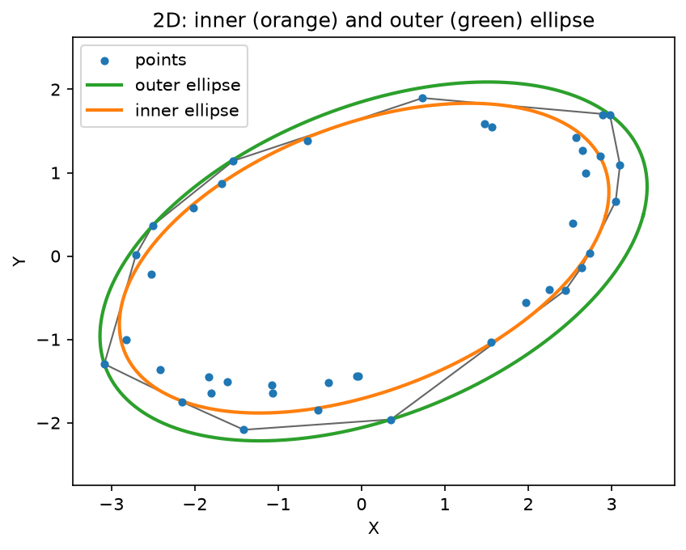
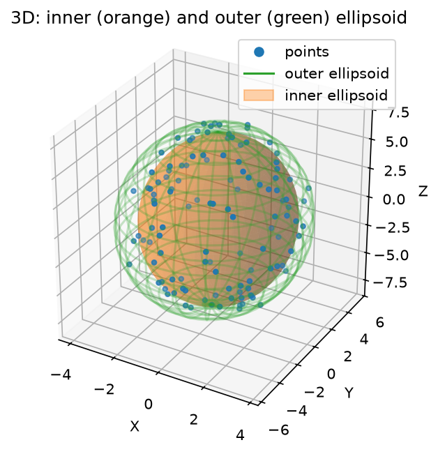

# Ellipsoid-Fit

[](https://github.com/rmsandu/Ellipsoid-Fit/actions/workflows/ci.yml)

Fit a cloud of points (2D or 3D) with the maximum-volume inscribed ellipsoid and the minimum-volume enclosing ellipsoid — also known as the inner and outer [Löwner-John ellipsoids](https://en.wikipedia.org/wiki/John_ellipsoid).

The inner-ellipsoid fit is a semidefinite program solved with [CVXPY](https://www.cvxpy.org/), as described in this [Stack Overflow answer](https://stackoverflow.com/questions/61859098/maximum-volume-inscribed-ellipsoid-in-a-polytope-set-of-points/61905793#61905793). The outer-ellipsoid fit uses the classic Khachiyan algorithm.

## Results

2D: points (blue), their convex hull (grey), outer ellipse (green), inner ellipse (orange).



3D: points (blue), outer ellipsoid (green wireframe), inner ellipsoid (orange surface).



Both figures are generated by the scripts in `examples/` and can be regenerated at any time (see below).

## Installation

```bash
pip install -e .
```

This installs `numpy`, `scipy`, `matplotlib`, and `cvxpy`. CVXPY ships with pure-Python SDP solvers (CLARABEL, SCS) that work out of the box on any platform, so a plain `pip install` is sufficient — no separate conda environment is required.

For running the tests as well:

```bash
pip install -e ".[dev]"
```

## Usage

```python
from ellipsoid_fit import inner_ellipsoid_fit, outer_ellipsoid_fit, plot_fit, sample_ellipsoid_points

points = sample_ellipsoid_points(semi_axes=(3, 5, 7), n=120, noise_std=0.3, seed=0)  # or your own (N, 2)/(N, 3) array

B, d = inner_ellipsoid_fit(points)   # inner ellipsoid: {B @ u + d : ||u|| <= 1}
A, c = outer_ellipsoid_fit(points)   # outer ellipsoid: {x : (x-c).T @ A @ (x-c) <= 1}

plot_fit(points, inner=(B, d), outer=(A, c), show=True)
```

`plot_fit` handles both 2D and 3D point clouds automatically. See `examples/fit_2d.py` and `examples/fit_3d.py` for full runnable scripts (including how the figures above were generated), and `ellipsoid_fit/sampling.py` for the mockup data generators used as example input.

## Running the examples

```bash
python -m examples.fit_2d
python -m examples.fit_3d
```

Each writes its figure to `figures/` and opens an interactive matplotlib window (set `EF_NO_SHOW=1` to skip the interactive window, e.g. in CI or headless environments).

## Tests

```bash
pytest
```

Tests check that the inner ellipsoid stays within the point cloud's convex hull and that the outer ellipsoid contains all input points, for both 2D and 3D inputs.

## Repository layout

- `ellipsoid_fit/` — the library: `inner.py` (max-volume inscribed ellipsoid, SDP), `outer.py` (min-volume enclosing ellipsoid, Khachiyan), `hull.py` (shared convex-hull helper), `sampling.py` (mockup data generators), `visualize.py` (unified 2D/3D plotting).
- `examples/` — runnable scripts producing the figures above.
- `tests/` — pytest suite.
- `archive/` — an older, project-specific version of this code kept for historical reference; it is not runnable standalone.
